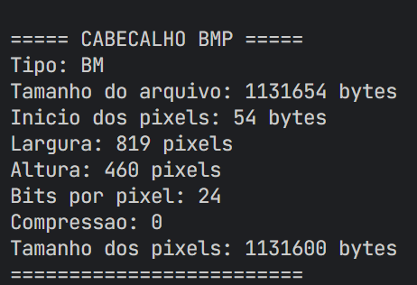
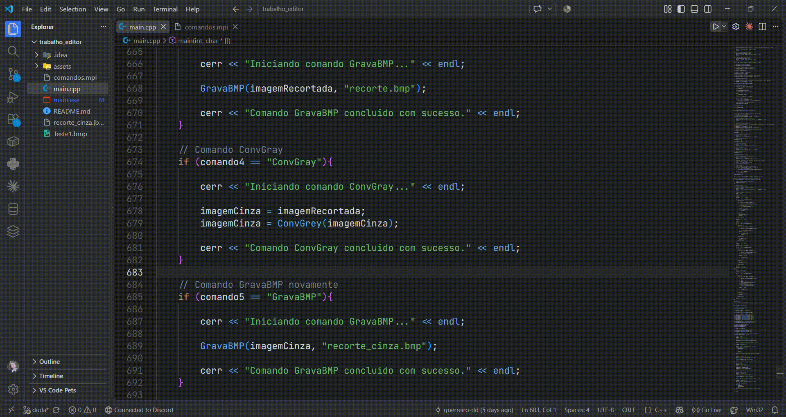

# Processador e Manipulador de Imagens BMP via JSON
## Manipulação e Conversão de Imagens Bitmap em C++

Este projeto é uma ferramenta desenvolvida em C++ para a leitura, processamento e exportação de dados de imagens no formato BMP (24-bit) sem compressão. A execução das operações é guiada por um arquivo de configuração no formato JSON (MPI), permitindo realizar parsing estruturado de metadados, operações de recorte (crop) espacial da imagem, conversão para tons de cinza (grayscale) utilizando média ponderada dos canais R, G e B, e a exportação da matriz de pixels resultante tanto em novos arquivos bitmap quanto em matrizes de dados estruturadas em JSON/JBMP.

## Demonstração de Funcionamento

Cabeçalho Lido no Terminal

Execução em Vídeo

### Pré-requisitos

Para compilar e executar o projeto em sua máquina local, você precisará ter instalado:

- Compilador C++: GCC / G++ (suporte a C++11 ou superior) ou MSVC.

- Ambiente CLI: Terminal Linux/macOS ou PowerShell/CMD no Windows.

- Git: Para clonar e versionar o repositório.

### Como Instalar e Rodar o Projeto

Siga o passo a passo abaixo para compilar e testar o programa em seu ambiente local:

Clonar o repositório:

    git clone https://github.com/seu-usuario/seu-repositorio.git
    cd seu-repositorio

Preparar os arquivos de entrada:

        Certifique-se de ter um arquivo comandos.mpi com as chaves e comandos necessários no mesmo diretório do executável.

        Coloque a imagem BMP de entrada (24 bits) indicada no arquivo de comandos dentro do mesmo diretório.

Compilar o código:

    g++ -std=c++11 main.cpp -o processador_bmp

Executar a aplicação:

No Linux/macOS:

        ./processador_bmp

No Windows:

        .\processador_bmp.exe

### Feedback e Suporte

Encontrou algum erro, bug na manipulação dos bytes de padding ou falha na leitura do arquivo JSON? Sinta-se à vontade para abrir uma Issue informando os detalhes do problema ou envie um Pull Request com correções!

### Futuras Melhorias

- Implementar suporte nativo a leitores/parsers de JSON completos via bibliotecas externas.

- Adicionar suporte a arquivos BMP comprimidos e com profundidades de bits diferentes (8-bit, 16-bit, 32-bit).

- Permitir a passagem do caminho do arquivo .mpi diretamente via argumentos da linha de comando (argc e argv).

- Otimizar o cálculo do padding e a alocação de memória para imagens de alta resolução.

### Autores

Eduarda Krug do Amaral - Github: dudakrug | LinkedIn: eduardakrug | Email: dudakrugamaral@gmail.com

Eduardo de Souza Guerreiro - GitHub: guerreiro-dd | LinkedIn: eduardoguerreiro | Email: eduardoguerreirodog@gmail.com
